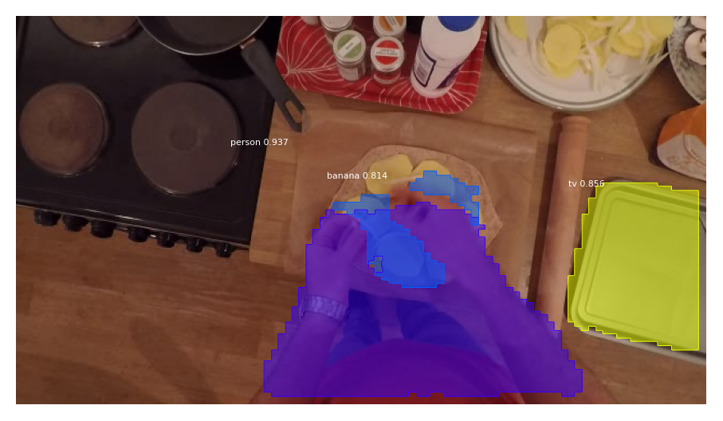

# EPIC-KITCHENS-100 MaskRCNN masks

[](https://epic-masks.readthedocs.io/en/latest/?badge=latest)

This repo contains a helper library for using the Mask-RCNN masks we extracted
on EPIC-KITCHENS-100.



## Installation

```console
$ python setup.py install
```

Or to hack on it

```console
$ python setup.py develop
```

## Downloads

We provide the object masks for all frames in EPIC Kitchens. These are avaiable to
download from [data.bris](https://data.bris.ac.uk/data/dataset/3l8eci2oqgst92n14w2yqi5ytu).

Please download the masks for P27_103 and P01_109 from
- https://www.dropbox.com/s/mzhguzwsyjxbh9e/P01_109.pkl?dl=0
- https://www.dropbox.com/s/zc15u7qlm3hqn0c/P27_103.pkl?dl=0

Those on data.bris were incorrectly extracted.

## Demo

Check out our [demo notebook](./notebooks/demo.ipynb) showing how to load and visualise the masks
